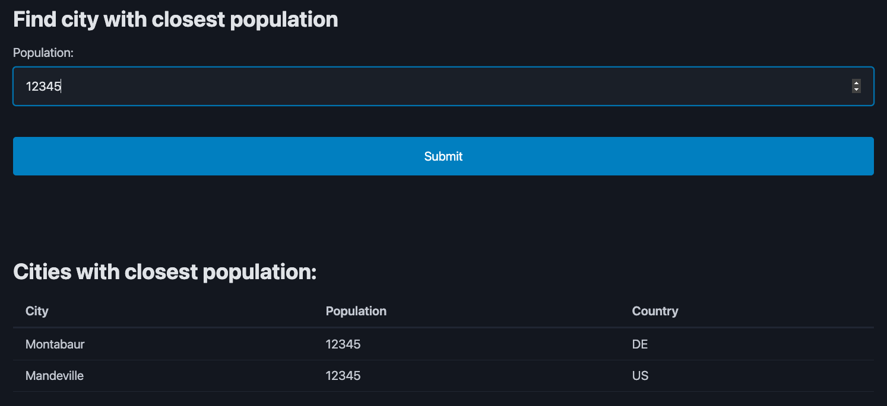

# find-city-by-population

Example go app, that can leaves room to optimize cpu / memory usage.




## Build

```
$ make build
```

## Develop

Requires a golang environment and then it can be run as follows:

```
# Download city dataset
$ make data

# After running the app, it will listen on port http://localhost:8081
$ go run ./


```

## City dataset

The dataset is from https://www.geonames.org/ and it is licensed under a Creative Commons Attribution 4.0 License.
